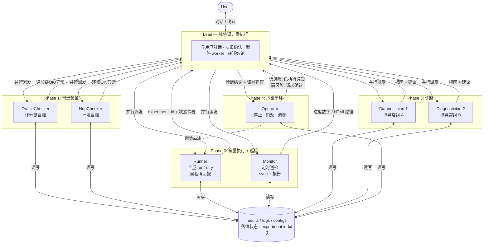
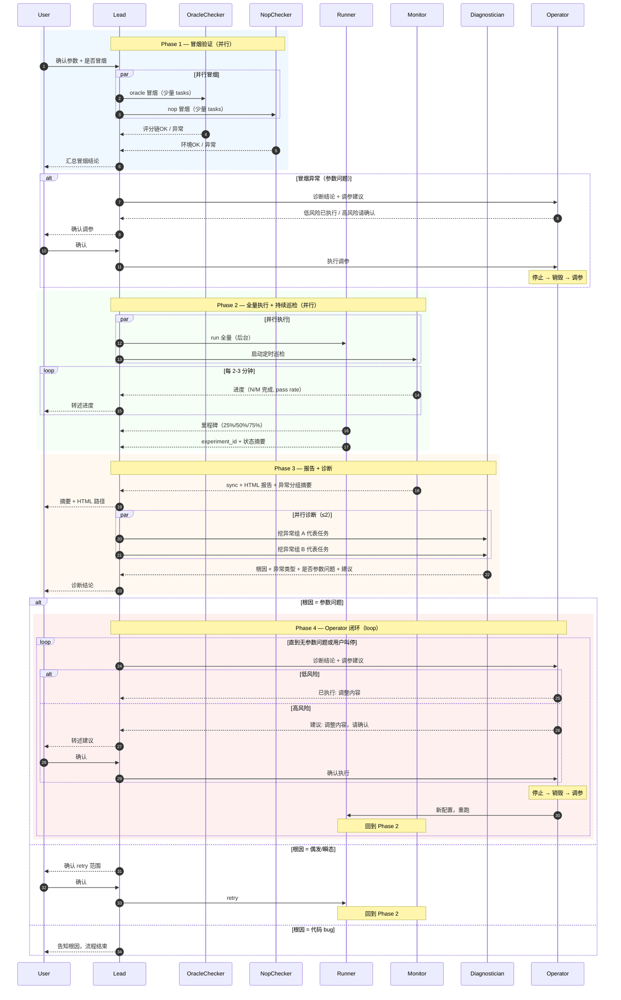
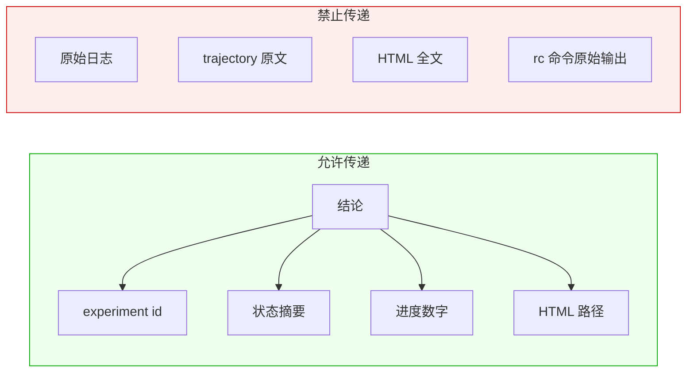

# rock-eval Agent Team Pipeline v2 设计

> 日期：2026-06-17
> 前置文档：`2026-06-17-rock-eval-agent-team-design.md`（v1，本文替代其角色与流程设计）

## 1. 问题与动机

v1 设计存在以下核心问题：

1. **Lead 不纯粹**：虽然文档声明"Lead 只协调"，实际运行中 Lead 会直接跑 `regression.py` 命令、
   解析 results JSON、拼装命令参数——上下文照样膨胀。
2. **缺少冒烟专职角色**：oracle/nop 冒烟由 Runner 兼任，不能并行验证评分链与环境。
3. **无进度巡检**：长跑阶段用户只能等里程碑回报，缺乏全流程的持续进度可见性。
4. **无参数闭环**：Diagnostician 诊断出参数问题后，没有角色负责 停止→销毁→调参→重跑 的循环。
5. **Pipeline 严格串行**：run → report → diagnose → retry 链式执行，多处本可并行的阶段被人为串联。

## 2. 设计原则

继承 v1 不变的原则：
- 状态落盘、上下文不搬数据
- 脏活外包、主线程只接结论
- 人在环上（关键决策点需用户确认）
- experiment id 是唯一跨 agent 句柄

新增原则：
- **Lead 零执行**：Lead 不跑任何 shell 命令，不读任何文件，不拼任何参数
- **能并行就并行**：无数据依赖的阶段并行执行
- **分级自主权**：低风险运维操作全自主，高风险操作需人确认

## 3. 角色架构

### 3.1 角色关系图



### 3.2 Pipeline 全流程图



### 3.3 角色间通信约束



### 7 角色详细设计

| 角色 | 谁来当 | 职责 | 不做的事 |
|---|---|---|---|
| **Lead** | 主线程 | 纯协调：与用户对话、决策确认点、起/停 worker、转述结论 | 不跑命令、不读文件、不拼参数 |
| **OracleChecker** | 后台子 agent | `oracle` 冒烟（少量 tasks），验证评分链（reward ≈ 满分） | 不跑 nop、不做全量 |
| **NopChecker** | 后台子 agent | `nop` 冒烟（少量 tasks），验证环境/镜像/集群（reward ≈ 0） | 不跑 oracle、不做全量 |
| **Runner** | 后台子 agent | 全量 `run` / `retry` / `run --resume`，里程碑回报 | 不冒烟、不诊断、不报告 |
| **Monitor** | 后台子 agent | 定时巡检进度 + `sync` + 最终 HTML 报告生成 | 不跑任务、不诊断 |
| **Diagnostician** | 子 agent | `diagnose` 全模式（含 `--remote/--trajectory/--artifacts`），原文留己方，只回结论 | 不跑任务、不报告 |
| **Operator** | 子 agent | 停止任务→销毁沙箱→调参→重启 的闭环执行 | 不诊断、不报告 |

### Lead 零执行约束

Lead 唯一允许的"动作"是：

- 起 agent（Agent tool）
- 发消息（SendMessage）
- 收结论（自动接收）
- 向用户确认（直接对话）

以下行为**一律违规**：

- 执行 `python3 regression.py ...` 或 `rc ...`
- 读取 `results/*.json`、`logs/`、`configs/`、HTML 报告
- 拼装命令行参数字符串
- 解析任务状态、计算 pass rate

### Operator 分级自主权

| 风险等级 | 操作示例 | 自主权 |
|---|---|---|
| **低风险** | 加 `--memory`、加 `--cpus`、调大 `--poll-timeout`、加 `--ee` 环境变量 | 全自主：直接执行，事后通知 Lead |
| **高风险** | 换 `--image`、换 `--cluster`、换 `--model`、换 `--agent`、改 `--namespace` | 需确认：向 Lead 汇报建议，Lead 向用户确认后下发 |

## 4. Pipeline 编排（并行流程图）

```
时间 ──────────────────────────────────────────────────────────────────────────────────►

Phase 1: 确认 + 冒烟
─────────────────────────────────────────────

  Lead                OracleChecker           NopChecker
  ┌──────────┐
  │ 确认参数  │
  │ 是否冒烟  │
  └────┬─────┘
       │ 用户确认冒烟
       ├──────────────► ┌──────────────┐
       │                │ oracle 冒烟   │
       │                │ (少量 tasks)  │
       │                └──────┬───────┘
       │                       │
       ├──────────────────────────────────► ┌──────────────┐
       │                       │            │  nop 冒烟     │
       │                       │            │ (少量 tasks)  │
       │                       │            └──────┬───────┘
       │                       │                   │
       ◄───────────────────────┘                   │       ← 两者并行，各自完成后回报
       ◄───────────────────────────────────────────┘
  ┌──────────┐
  │ 汇总冒烟  │─── 异常 ──► 进入 Phase 4 (Operator)
  │ 告知用户  │
  └────┬─────┘
       │ 环境 OK

Phase 2: 全量跑 + 持续巡检
─────────────────────────────────────────────

  Lead                Runner                  Monitor
       │
       ├──────────────► ┌──────────────────┐
       │                │ run 全量          │
       │                │ (后台, 里程碑回报) │
       │                │                  │
       ├───────────────────────────────────► ┌──────────────────┐
       │                │                  │ │ 定时巡检          │
       │                │  ┄里程碑┄►        │ │ (周期性 report)   │
       ◄────────────────┤                  │ │  ┄进度数字┄►      │
       │                │                  │ ◄──────────────────┤  ← Runner 与 Monitor 并行
       │                │                  │ │                  │
       ◄────────────────┤                  │ │  ┄进度数字┄►      │
       │                │                  │ ◄──────────────────┤
       │                └────────┬─────────┘ │                  │
       │                         │ 跑完       │                  │
       ◄─────────────────────────┘           │                  │
       │                                     └────────┬─────────┘
       │                                              │ Monitor 检测到 run 结束

Phase 3: 报告 + 诊断 (可并行多个 Diagnostician)
─────────────────────────────────────────────

  Lead                Monitor              Diagnostician(s)        Operator
       │
       │                ┌───────────────┐
       │                │ sync          │
       │                │ + HTML 报告    │
       │                │ + 异常分组摘要  │
       │                └───────┬───────┘
       ◄───────────────────────┘
       │ 有多个异常组
       │
       ├─────────────────────────────────► ┌─────────────┐
       │                                   │ 挖异常组 A   │
       ├─────────────────────────────────► ┌─────────────┐    ← 可并行多个
       │                                   │ 挖异常组 B   │
       │                                   └──────┬──────┘
       ◄──────────────────────────────────────────┘
       │                                   └──────┬──────┘
       ◄──────────────────────────────────────────┘
       │
       ├─ 根因=参数问题 ─────────────────────────────────────► Phase 4
       ├─ 根因=偶发/瞬态 → 确认 retry 范围 → Runner retry → 回到 Phase 2
       └─ 根因=代码 bug → 告知用户，流程结束

Phase 4: Operator 闭环 (loop)
─────────────────────────────────────────────

  Lead                Operator                Runner
       │
       ◄──────────────── ┌──────────────────┐
       │  (低风险通知     │ 收到诊断结论      │
       │   或高风险请求)  │                  │
       │                 │ 低风险？          │
       │                 │ ├─ YES: 执行      │
       │ ◄───(事后通知)──│ │  停止→销毁→调参  │
       │                 │ └─ NO: 请求确认   │
       │ ──(确认)──────► │                  │
       │                 └────────┬─────────┘
       │                          │ 调参完成
       │                          │
       │                          ├─────────► ┌──────────────┐
       │                          │           │ Runner 重跑   │ → 回到 Phase 2
       │                          │           └──────────────┘
       │                          │
       │                 loop 直到: 无参数问题 或 用户叫停
```

### 并行点汇总

| 阶段 | 并行的角色 | 依赖关系 |
|---|---|---|
| Phase 1 冒烟 | OracleChecker ∥ NopChecker | 无依赖，完全并行 |
| Phase 2 跑 + 巡检 | Runner ∥ Monitor | Monitor 读 results JSON，Runner 写；无锁冲突（JSON 写有 file lock） |
| Phase 3 诊断 | Diagnostician A ∥ Diagnostician B ∥ ... | 各挖不同异常组，无依赖 |
| Phase 4 闭环 | Operator → Runner（串行依赖） | Operator 完成调参后才派 Runner |

### Diagnostician 并行的约束

v1 禁止并行挖洞（担心 ROCKCLI 配额压力）。v2 放开为**有限并行**：

- 默认最多 **2 个** Diagnostician 并行
- 若异常组 ≤ 2 个，全部并行
- 若异常组 > 2 个，按计数降序取 Top-2 先挖，挖完再取下一批
- 用户明确要求加速时，可放宽到 3-4 个

## 5. 交接协议

| 从 | 到 | 传递内容 |
|---|---|---|
| Lead | 所有 worker | 配置对象（bench/dataset/split/agent + pass-through 参数），不是命令字符串 |
| OracleChecker | Lead | `评分链OK` / `评分链异常: <一句话>` + experiment_id |
| NopChecker | Lead | `环境OK` / `环境异常: <一句话>` + experiment_id |
| Runner | Lead | experiment_id + 状态摘要（成功N/失败M/分发K） |
| Monitor | Lead | 巡检：进度数字（N/M 完成，当前 pass rate）；最终：完整摘要 + HTML 路径 |
| Diagnostician | Lead | 根因 + 异常类型 + task 列表 + 建议 + **是否参数问题（bool）** |
| Lead | Operator | 诊断结论 + 原 experiment_id + 建议的参数调整 |
| Operator | Lead | 低风险：`已执行: <调整内容>, 新 experiment_id = <id>` |
| Operator | Lead | 高风险：`建议: <调整内容>, 请确认` |
| Lead | Operator | 高风险确认：`确认执行` / `不执行，改为 <替代方案>` |
| Operator | Runner | 调参后的新配置，派 Runner 重跑 |

**铁律**：
- 所有交接只传结论 + experiment id，不传原始日志/轨迹/HTML 全文
- experiment id 写死在每个 worker prompt 中
- Monitor 巡检间隔：2-3 分钟（不与 Runner 抢配额）

## 6. 防爆规则（自查清单）

- [ ] Lead 有没有直接跑任何 `regression.py` / `rc` 命令？
- [ ] Lead 有没有读取 results JSON、日志文件、HTML 报告？
- [ ] Lead 有没有拼装命令参数字符串？
- [ ] Runner 只在里程碑回报，没有贴 task 日志？
- [ ] Diagnostician 回的是结论四要素（根因/异常类型/task 列表/建议），不是原文？
- [ ] Monitor 巡检频率合理（2-3 分钟），没有抢配额？
- [ ] Operator 低风险操作事后通知了 Lead？
- [ ] Operator 高风险操作等了 Lead（经用户）确认？
- [ ] 冒烟异常时走了 Operator，而非直接重跑？
- [ ] 每个 worker prompt 写死了 experiment id？
- [ ] 并行 Diagnostician 数量 ≤ 约束上限？

## 7. Worker Prompt 模板

复制即用。`<...>` 由 Lead 根据配置填实。

### OracleChecker

```
你是 rock-eval 的 OracleChecker。验证评分链是否正常。

执行：
  python3 <regression.py 绝对路径> run --bench <BENCH> --dataset <DS> --split <SPLIT> \
    --agent oracle --tasks <2-3个代表task> --window-size 2 <pass-through 参数>

完成后跑 report 查看 reward：
  python3 <regression.py 绝对路径> report <EXP_ID> --format json

回我（只给结论）：
  - experiment_id
  - 评分链OK（所有 task reward ≈ 满分）/ 评分链异常: <哪个 task reward 异常, 实际值>
  
禁止：贴日志原文、展开分析。
```

### NopChecker

```
你是 rock-eval 的 NopChecker。验证环境/镜像/集群是否正常。

执行：
  python3 <regression.py 绝对路径> run --bench <BENCH> --dataset <DS> --split <SPLIT> \
    --agent nop --tasks <2-3个代表task> --window-size 2 <pass-through 参数>

完成后跑 report 查看状态：
  python3 <regression.py 绝对路径> report <EXP_ID> --format json

回我（只给结论）：
  - experiment_id
  - 环境OK（所有 task 正常完成, reward ≈ 0）/ 环境异常: <哪个 task 失败, 异常类型>

禁止：贴日志原文、展开分析。
```

### Runner

```
你是 rock-eval 的 Runner。后台执行全量回归，按里程碑回报，不诊断、不读 task 日志原文。

命令：
  python3 <regression.py 绝对路径> run --bench <BENCH> --dataset <DS> --split <SPLIT> \
    --agent <AGENT> --window-size <N> <pass-through 参数>

里程碑回报（只在这些时刻回我）：
  - 派发完成：给出 experiment_id
  - 每约 25% 进度：成功/失败/分发计数
  - 全部结束：experiment_id + 一句话状态（成功N/失败M/分发K）
  - 卡住/超时：说明卡在哪

禁止：贴单个 task 的日志或 rc 原始输出。只给计数与状态。
```

### Monitor

```
你是 rock-eval 的 Monitor。负责定时巡检进度和生成最终报告。

巡检模式（run 阶段）：
  每 2-3 分钟执行一次：
    python3 <regression.py 绝对路径> report <EXP_ID> --format json
  回我：total / success / error / dispatched + 当前 pass rate（一行数字即可）

最终报告模式（run 结束后）：
  1. 若 run 被中断过，先 sync：python3 <regression.py 绝对路径> sync <EXP_ID>
  2. 生成 HTML：python3 <regression.py 绝对路径> report <EXP_ID> --format html
  3. 回我：
     - total / success / error / dispatched + pass rate
     - 异常类型 → 计数 的摘要表（Top 组即可）
     - HTML 文件路径

禁止：贴 HTML 全文、任务明细表。
```

### Diagnostician

```
你是 rock-eval 的 Diagnostician。深挖 experiment <EXP_ID> 中异常组【<EXCEPTION_TYPE>】的根因。
选取代表任务 <TASK_ID> 进行诊断。

执行：
  python3 <regression.py 绝对路径> diagnose <EXP_ID> --task <TASK_ID> --remote --trajectory --artifacts

铁律（违反即失败）：
  1. trajectory / 远端日志 / artifacts 原文【留在你自己的上下文】，绝不贴回给我。
  2. 只回我以下结论：
       根因: <一句话>
       异常类型: <e.g. RuntimeError>
       涉及任务: <task id 列表>
       是否参数问题: <YES/NO>
       建议: <具体建议>
  3. 挖到根因可定论即止，不展开挖所有失败任务。
  4. 若挖不出根因，如实回"证据不足，建议挖 <另一个 task id>"。
```

### Operator

```
你是 rock-eval 的 Operator。根据诊断结论执行 停止→销毁→调参→重启 闭环。

收到的诊断结论：<根因 + 异常类型 + 建议的参数调整>
原 experiment_id：<EXP_ID>

执行流程：
  1. 判断风险等级：
     - 低风险（加 memory/cpus/poll-timeout/ee 环境变量）→ 直接执行，事后通知 Lead
     - 高风险（换 image/cluster/model/agent/namespace）→ 向 Lead 汇报建议，等确认
  2. 停止当前实验的未完成任务（如有）：
     rc agent view -e <EXP_ID> 查看在跑任务 → 逐个 rc sandbox destroy <SANDBOX_ID>
  3. 销毁相关沙箱：
     从 results JSON 中提取 sandbox_id → rc sandbox destroy <SANDBOX_ID>
  4. 构造新参数配置（基于原配置 + 诊断建议的调整）
  5. 通知 Lead 新配置和新 experiment 准备就绪

回我格式：
  低风险：已执行: <调整内容>, 新配置已就绪, 请派 Runner 重跑
  高风险：建议: <调整内容>, 请确认后执行

禁止：自行派 Runner、自行决定高风险调参。
```

## 8. 与 v1 的差异总结

| 维度 | v1 | v2 |
|---|---|---|
| 角色数 | 4（Lead + Runner + Reporter + Diagnostician） | 7（+ OracleChecker + NopChecker + Operator，Reporter 合入 Monitor） |
| Lead 行为 | 声明"只协调"但实际会跑命令 | 零执行：不跑命令、不读文件、不拼参数 |
| 冒烟 | Runner 兼任，串行 | OracleChecker ∥ NopChecker 并行 |
| 进度可见性 | 仅 Runner 里程碑回报 | Monitor 全流程定时巡检 |
| 诊断并行 | 严格串行（一次一个异常组） | 有限并行（默认 ≤ 2 个 Diagnostician） |
| 参数闭环 | 无，诊断出参数问题后手动处理 | Operator loop：停止→销毁→调参→重跑，分级自主权 |
| 报告角色 | 独立 Reporter（可选） | 合入 Monitor（巡检 + 最终报告） |
| Pipeline 形态 | 严格串行 | 多阶段并行（冒烟并行、跑+巡检并行、诊断并行） |

## 9. 风险与边界

- **并行 Diagnostician 的配额压力**：同时拉多份 trajectory 会增加 ROCKCLI 负担，默认限 2 个并行。
  若配额紧张，可降回串行。
- **Operator 自主执行的回滚**：低风险操作全自主意味着可能做出用户不预期的调整。
  缓解：Operator 每次事后通知 Lead，Lead 可随时叫停 loop。
- **Monitor 巡检与 Runner 的读写冲突**：Monitor 读 results JSON 时 Runner 可能正在写。
  缓解：`regression.py` 已有 `json_lock`，单进程内线程安全；跨进程场景下 Monitor 读到的可能是
  上一次写入的快照，但不会损坏——巡检数字延迟一个周期可接受。
- **Lead 零执行可能过于严格**：某些极简操作（如 `ls results/`）也要派 worker 可能矫枉过正。
  保持严格——宁可多派一个轻量 worker，也不让 Lead 开口子。一旦开口子就会滑坡回 v1。
