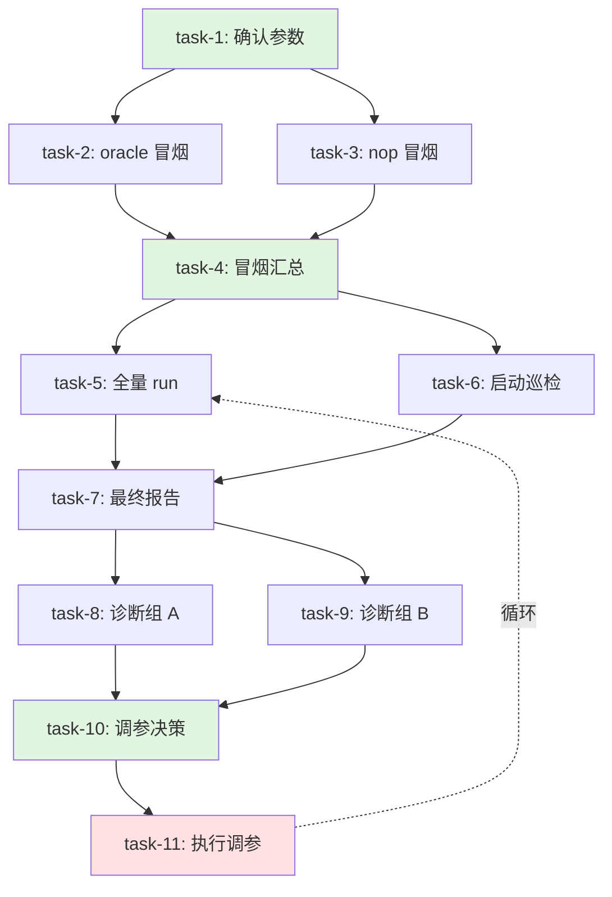

# rock-eval Agent Team TeamCreate 架构设计

> 日期：2026-06-17
> 前置文档：`2026-06-17-rock-eval-pipeline-v2-design.md`（v2 设计，本文用 TeamCreate 重构）
> 目标：用 CC 原生 TeamCreate + TaskList 替代 prompt-driven 手工编排

## 1. 设计原则

### 1.1 TeamCreate 核心优势

| 原有方式 | TeamCreate 方式 |
|---------|-----------------|
| 靠 Lead 的 prompt 记忆按 runbook 执行 | 任务状态持久化，可跨会话恢复 |
| "铁律"靠 prompt 软约束 | 任务依赖关系通过 blocks/blockedBy 硬编码 |
| 7 角色协调全靠 SendMessage | TaskList 提供任务发现和分配机制 |
| 进度跟踪靠 Lead 手动汇总 | TaskList 的 status/in_progress/completed 自动跟踪 |

### 1.2 保留的内容

- **CronCreate**：Monitor 的定时巡检仍需此工具
- **SendMessage**：teammates 间的直接通信（结论传递）
- **Structured Output (Schema)**：所有 agent 输出仍用 schema 强制（见 §6）

### 1.3 改动的内容

- Lead 的协调逻辑 → 固化为 TaskList 依赖链
- "Phase 1/2/3/4" 的手工作业流 → 任务状态机驱动
- "并行派 OracleChecker + NopChecker" → TaskList 的并行未阻塞任务

## 2. Team 结构

### 2.1 Team 配置

```yaml
team_name: rock-eval-team
description: rock-eval 7 角色并行 pipeline 的 TeamCreate 实现
agent_type: general-purpose  # team lead 类型
```

### 2.2 Teammate 分配

| Teammate | 角色 | 职责 | 生命周期 |
|---------|------|------|---------|
| **lead** | Lead | 纯协调：确认用户意图、初始化任务列表、汇总结论 | 全程 |
| **smoke-oracle** | OracleChecker | 评分链冒烟 | Phase 1 |
| **smoke-nop** | NopChecker | 环境冒烟 | Phase 1 |
| **runner** | Runner | 全量 run/retry，里程碑回报 | Phase 2+ |
| **monitor** | Monitor | 定时巡检 + 最终报告 | Phase 2+3 |
| **diagnostician** | Diagnostician | 诊断异常组（可多实例） | Phase 3 |
| **operator** | Operator | 调参闭环 | Phase 4 |

> **说明**：lead 是 team leader，其他 6 个是派生 teammates。

### 2.3 Teammate 交互规则

- **任务发现**：teammates 通过 `TaskList` 找 status=pending 且 blockedBy=[] 的任务
- **任务认领**：用 `TaskUpdate` 设置 `owner=<teammate-name>`，status=in_progress
- **任务完成**：完成后 `TaskUpdate` 设置 status=completed，addBlocks 指向依赖它的任务
- **消息传递**：teammates 间通过 `SendMessage` 传递结论（schema 结构化）

## 3. 任务分解

### 3.1 任务列表结构

```
rock-eval-team/
├─ task-1:  [pending] 确认参数 + 是否冒烟
│  └─ blocks: task-2, task-3
│
├─ task-2:  [pending] oracle 冒烟（smoke-oracle）
│  └─ blockedBy: task-1
│  └─ blocks: task-4
│
├─ task-3:  [pending] nop 冒烟（smoke-nop）
│  └─ blockedBy: task-1
│  └─ blocks: task-4
│
├─ task-1.5: [pending] 对齐基线确认（可选）
│   └─ blockedBy: task-2, task-3
│   └─ blocks: task-5
│
├─ task-4:  [pending] 冒烟汇总决策
│  └─ blockedBy: task-2, task-3
│  └─ blocks: task-5
│
├─ task-5:  [pending] 启动全量 run（runner）
│  └─ blockedBy: task-4
│  └─ blocks: task-7
│
├─ task-6:  [pending] 启动巡检（monitor）
│  └─ blockedBy: task-4
│  └─ blocks: task-7
│
├─ task-7:  [pending] 生成最终报告（monitor）
│  └─ blockedBy: task-5, task-6
│  └─ blocks: task-8, task-9
│
├─ task-8:  [pending] 诊断异常组 A（diagnostician）
│  └─ blockedBy: task-7
│  └─ blocks: task-10
│
├─ task-9:  [pending] 诊断异常组 B（diagnostician）
│  └─ blockedBy: task-7
│  └─ blocks: task-10
│
├─ task-10: [pending] 调参决策
│  └─ blockedBy: task-8, task-9
│  └─ blocks: task-11
│
└─ task-11: [pending] 执行调参（operator）
   └─ blockedBy: task-10
   └─ blocks: task-5  # 调参后回到 task-5 重跑
```

### 3.2 任务详细定义

| Task ID | 任务名 | 分配给 | 输入 | 输出 | Schema |
|---------|--------|--------|------|------|--------|
| task-1 | 确认参数 + 是否冒烟 | lead | 用户配置 | config 对象 + smoke=yes/no | `ConfigConfirmOutput` |
| task-2 | oracle 冒烟 | smoke-oracle | bench/agent/任务列表 | experiment_id + ok + detail? | `SmokeOutput` |
| task-3 | nop 冒烟 | smoke-nop | bench/agent/任务列表 | experiment_id + ok + detail? | `SmokeOutput` |
| task-1.5 | 对齐基线确认 | lead | 用户回答 + 参考来源 | baseline_file + config_diff? | `AlignmentOutput` |
| task-4 | 冒烟汇总决策 | lead | task-2 + task-3 输出 | 决策：进入 Phase 2 或走 Operator | `SmokeDecisionOutput` |
| task-5 | 启动全量 run | runner | 完整配置 | experiment_id + 里程碑进度 | `RunnerOutput` |
| task-6 | 启动巡检 | monitor | experiment_id | 巡检进度 + 可疑信号 | `MonitorPatrolOutput` |
| task-7 | 生成最终报告 | monitor | experiment_id | 摘要 + HTML 路径 + 异常分组 | `ReportOutput` |
| task-8 | 诊断异常组 A | diagnostician | exp_id + exception_type | 根因 + 类型 + tasks + is_param + 建议 | `DiagnoseOutput` |
| task-9 | 诊断异常组 B | diagnostician | exp_id + exception_type | 同上 | `DiagnoseOutput` |
| task-10 | 调参决策 | lead | task-8 + task-9 输出 | 是否调参 + 风险等级 + 调参建议 | `TuningDecisionOutput` |
| task-11 | 执行调参 | operator | 原 exp_id + 调参建议 | 新配置 + 新 experiment_id | `OperatorOutput` |

### 3.3 循环依赖设计

Phase 4 → Phase 2 的循环通过 `task-11` 完成后：
1. 将 `task-11.blocks` 指向 `task-5`（重跑）
2. 将 `task-5` 的 status 重置为 `pending`，owner 清空
3. 同时将 `task-6`（巡检）也重置，配合新的 run

## 4. 依赖关系图



## 5. 状态流转

### 5.1 任务状态机

```
pending → in_progress → completed
   ↑                         ↓
   └─────── (重跑循环) ───────┘
```

### 5.2 特殊状态处理

| 场景 | 处理 |
|------|------|
| 冒烟失败 | task-4 决策：blocks 指向 task-11（跳过 run，直接调参） |
| 长跑中断 | task-5 status 仍为 in_progress，task-6 继续巡检 |
| 诊断不足 | task-8/9 完成 but 建议挖更多 task → lead 创建新 task-8.1/9.1 |
| 调参无效 | task-11 完成后添加 metadata `no_improvement_count`，累计 3 次 task-10 决策停止 |

### 5.3 跨会话恢复

TeamCreate 提供的任务目录在 `~/.claude/tasks/{team_name}/`，可跨会话访问：

1. **会话中断恢复**：新会话中 lead 检查 TaskList，找 status=in_progress 的任务
2. **长跑后台恢复**：Runner 是后台 Agent，会话关闭后继续跑；Monitor 的 Cron 是 session-only，会话关闭需重新起（或用 durable: true）

## 6. Structured Output Schema

所有 agent 输出必须通过 schema 强制结构化，替代"铁律"软约束。

### 6.1 核心 Schema 定义

```typescript
// 冒烟输出
interface SmokeOutput {
  experiment_id: string
  ok: boolean
  detail?: string  // 仅 ok=false 时填写
}

// 报告输出
interface ReportOutput {
  total: number
  success: number
  error: number
  dispatched: number
  pass_rate: number
  html_path: string
  exception_groups: Array<{type: string, count: number, sample_message: string}>
}

// 诊断输出
interface DiagnoseOutput {
  root_cause: string
  exception_type: string
  tasks: string[]
  is_param_issue: boolean
  suggestion: string
}

// 调参决策输出
interface TuningDecisionOutput {
  should_tune: boolean
  risk_level: 'low' | 'high'
  tuning_params: {
    memory?: string
    cpus?: string
    poll_timeout?: number
    image?: string
    cluster?: string
    model?: string
    agent?: string
    namespace?: string
    ee?: string[]
  }
  reason: string
}

// Operator 输出
interface OperatorOutput {
  action_taken: string
  new_experiment_id?: string
  detail: string
}
```

### 6.2 Schema 在 Workflow 中的使用

虽然控制流改用 TeamCreate，但每个具体任务的执行仍推荐用 **Agent tool with schema**：

```javascript
const smokeResult = await agent(
  `你是 OracleChecker，执行冒烟验证...（prompt 内容）`,
  { schema: SMOKE_OUTPUT_SCHEMA, agentType: 'general-purpose' }
)
```

这样 Agent 会自动调用 StructuredOutput tool，返回符合 schema 的对象。

## 7. TaskList 操作 API

### 7.1 Lead（team leader）的操作

```javascript
// 初始化任务列表
TaskCreate({ subject: '确认参数 + 是否冒烟', description: '...' })

// 查找可用任务
const tasks = await TaskList()

// 创建子任务并建立依赖
const smokeTask = await TaskCreate({
  subject: 'oracle 冒烟',
  description: '...',
  addBlockedBy: ['task-1']  // 依赖 task-1
})

// 设置任务完成后释放下游
await TaskUpdate({
  taskId: 'task-2',
  status: 'completed',
  addBlocks: ['task-4']  // 释放 task-4
})
```

### 7.2 Teammate 的操作

```javascript
// 查找可认领任务
const tasks = await TaskList()
const myTask = tasks.find(t =>
  t.status === 'pending' &&
  t.blockedBy.length === 0 &&
  t.owner === ''
)

// 认领任务
await TaskUpdate({
  taskId: myTask.id,
  owner: 'smoke-oracle',
  status: 'in_progress'
})

// 完成任务
await TaskUpdate({
  taskId: myTask.id,
  status: 'completed',
  addBlocks: ['task-4']  // 释放依赖它的任务
})
```

## 8. 与现有 tool 的集成

### 8.1 CronCreate（Monitor 巡检）

Monitor 在 task-6 完成时（即启动巡检）：

```javascript
await CronCreate({
  cron: '*/3 * * * *',  // 每 3 分钟
  prompt: '你是巡检 agent，执行 sync + report --format json + monitor-state.json 更新 + 判据...',
  recurring: true,
  durable: false  // session-only
})
```

Monitor 在 task-7 完成时（最终报告）：

```javascript
await CronDelete({ id: patrolJobId })
```

### 8.2 SendMessage（Teammate 通信）

虽然 TaskList 负责任务流转，但某些场景仍需直接通信：

1. **Runner 里程碑通知**：Runner → Lead，`SendMessage({ to: 'lead', summary: '25%', message: '...' })`
2. **Monitor 可疑信号**：Monitor → Lead，`SendMessage({ to: 'lead', summary: '可疑', message: schema })`
3. **Operator 高风险确认**：Operator → Lead → User，`SendMessage({ to: 'lead', ... })` 然后 Lead 向用户确认

### 8.3 后台 Agent（Runner）

Runner 是长任务，用 `run_in_background: true`：

```javascript
await Agent({
  description: '全量 run 后台执行',
  prompt: '你是 Runner...',
  run_in_background: true,
  name: 'runner'
})
```

## 9. 实现步骤

### 9.1 Phase 1 - 基础设施

1. 创建 TeamCreate 配置（手动或通过脚本）
2. 定义初始任务列表模板（task-1 到 task-11）
3. 实现 lead 的 TaskList 查询和任务创建逻辑
4. 实现 teammates 的任务认领和完成逻辑

### 9.2 Phase 2 - Schema 定义

1. 定义所有输出 schema（TypeScript/JSON Schema）
2. 修改各 role 的 prompt，要求输出符合 schema
3. 测试 Agent tool with schema 的返回值

### 9.3 Phase 3 - 依赖流

1. 实现 task-1 → task-2/3 的并行派发
2. 实现 task-2/3 → task-4 的汇总
3. 实现 task-4 → task-5/6 的并行派发
4. 实现 task-5/6 → task-7 的同步

### 9.4 Phase 4 - 循环与恢复

1. 实现 task-11 → task-5 的循环重置
2. 实现跨会话恢复：lead 检查 in_progress 任务
3. 实现 Monitor 的 Cron 重新启动（如 durable: false）

### 9.5 Phase 5 - 与 SKILL.md 集成

1. 在 SKILL.md 中添加 TeamCreate 模式入口
2. 更新 `references/team-orchestration.md`，添加 TeamCreate 版本的 runbook
3. 保留原有的 prompt-driven 版本作为备选（legacy）

## 10. 风险与边界

### 10.1 已知风险

| 风险 | 缓解 |
|------|------|
| TeamCreate 任务目录与会话绑定 | `~/.claude/tasks/{team_name}/` 是跨会话的，但需确保 team_name 唯一 |
| Monitor 的 Cron 是 session-only | 提供用户选项：默认 session-only，长跑可用 durable: true |
| 后台 Runner 会话关闭后不可控 | Runner 的 Experiment 已在服务端，会话关闭不影响执行；只需恢复 Monitor |
| TaskList 并发修改 | CC 的 TaskUpdate 有原子性保证，无需额外锁 |

### 10.2 不做的事（YAGNI）

- 不做任务优先级（所有任务平等，只看依赖）
- 不做任务超时（任务超时由各 role 内部处理，如 Runner 的 poll-timeout）
- 不做任务重试（task 执行失败由 lead 决策是否重建 task）
- 不做跨 Team 协作（rock-eval 只有一个 Team）

## 11. 与 v2 的差异总结

| 维度 | v2（prompt-driven） | TeamCreate 版本 |
|------|---------------------|----------------|
| 控制流 | 靠 Lead 的 prompt 记忆 | TaskList 状态机 + blocks/blockedBy |
| 并行 | Lead 手动 spawn 多个 agent | TaskList 自动暴露并行任务（blockedBy=[]） |
| 进度跟踪 | Lead 主动汇总 | TaskList 的 status 自动跟踪 |
| 跨会话 | 不支持（会话关闭需重来） | 支持（TaskList 持久化） |
| 输出约束 | prompt "铁律" | schema 强制结构化 |
| 长跑支持 | 后台 Agent + session-only Cron | 后台 Agent + 可选 durable Cron |
| 循环 | Lead 手动重派任务 | TaskUpdate 重置 task 状态 + blocks 重指 |

## 12. 附录：TaskList 示例

```
~/.claude/tasks/rock-eval-team/
├── task-1.json
├── task-2.json
├── task-3.json
├── ...
└── task-11.json
```

`task-2.json` 示例：

```json
{
  "id": "task-2",
  "subject": "oracle 冒烟",
  "description": "验证评分链是否正常...",
  "status": "pending",
  "owner": "",
  "blockedBy": ["task-1"],
  "blocks": ["task-4"],
  "metadata": {
    "role": "smoke-oracle",
    "output_schema": "SmokeOutput"
  }
}
```
